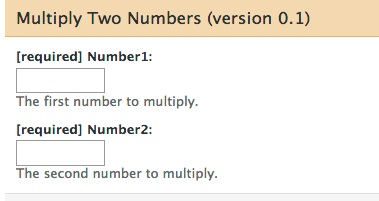

<!--
%\VignetteEngine{knitr::knitr}
%\VignetteIndexEntry{RGalaxy - BioC2013 Lab}
-->

# RGalaxy lab
## July 19, 2013


[Galaxy](http://galaxyproject.org/)
is an open, web-based platform for data-intensive biomedical research.
It provides an easy-to-use web interface and can expose bioinformatics
workflows written in any programming language.

The `RGalaxy` package allows you to take existing `R` functions and
expose them in Galaxy, so that anyone with a web browser can run
your function without needing any knowledge of `R`.

Let's start with a very simple example, based closely on one
from the `RGalaxy` vignette. This is a function which multiplies
two numbers. It's obviously too trivial to be of use to anyone,
but it illustrates some important principles.


```{r multiplyTwoNumbers}
multiplyTwoNumbers <- 
    function(
        number1=GalaxyNumericParam(required=TRUE),
        number2=GalaxyNumericParam(required=TRUE),
        product=GalaxyOutput("product", "txt"))
{
    cat(number1 * number2, file=product)
}

```

There are a few things to notice about this function:

* The data type of each parameter is specified. And instead of 
  just specifying `R`'s `numeric` type, we are using a special
  class called `GalaxyNumericParam`. This is because Galaxy
  (unlike `R`) needs to know the type of each parameter,
  as well as other information
* The function's name is descriptive.
* The return value of the function is not important. 
  Instead, the function writes information to one or more
  files.
* All the function's inputs and outputs are specified as
  named arguments in its signature. This is required as Galaxy
  communicates with tools by sending them files and reading
  files they generate.
* By default, parameters are marked as not required by Galaxy.
  Adding `required=TRUE` tells Galaxy not to allow empty values.
* This function can be run from within R, passing it ordinary
`numeric` values:

```{r run_multiplyTwoNumbers}
t <- tempfile()
multiplyTwoNumbers(2, 7, t)
readLines(t, warn=FALSE)
```

## Documenting the Example

We're almost ready to tell Galaxy about our function, but first we
need to document it with a manual page. `RGalaxy` will use information
in this page to create the Galaxy tool, and the man page will also
be useful to anyone who wants to run your function in `R`.

This command will open the man page (`multiplyTwoNumbers.Rd`) in
`RStudio`'s editor, so you can examine it:

```{r open_man_page}
manpage <- system.file("manpages", "multiplyTwoNumbers.Rd", package="RGalaxy.lab")
file.edit(manpage)
```

Some things to note about this man page:

* The `name`, `alias`, `description`, `title`, `usage`, and
  `arguments` sections are required. The `details` section
  is not required but its use is encouraged (`RGalaxy` will
  notify you if this section is missing).
* While it's good to have an `examples` section, this section
  is only useful to people running your function via `R`.
  This section is not used by `RGalaxy`.

## Installing Galaxy

If you were working on your own machine, you'd need to install Galaxy
at this point. You can refer to the `RGalaxy` vignette for information
about this procedure. Galaxy is already installed on the virtual 
machine you are accessing through your browser, so we'll skip the 
installation step for now.

We do however need to tell R where Galaxy is installed:

```{r set_galaxy_home}
galaxyHome <- "/extra/ubuntu/galaxy-dist"
```

```{r set_galaxy_home2, echo=FALSE, results="hide"}
hostname <- system2("hostname", stdout=TRUE)
if (grepl("^dhcp", hostname))
    galaxyHome <- "/Users/dtenenba/dev/galaxy-dist"
```


## Telling Galaxy about the function

Now we point Galaxy to the function we just wrote:

```{r run_galaxy, tidy=FALSE}
library(RGalaxy)
galaxy("multiplyTwoNumbers",
    manpage=manpage,
    version=0.1,
    galaxyConfig=
      GalaxyConfig(galaxyHome, "mytool", "Test Section",
        "testSectionId")
    )
```


```{r restart_galaxy_function, echo=FALSE}

restartGalaxy <- function(galaxyHome)
{
    oldwd <- getwd()
    on.exit(setwd(oldwd))
    setwd(galaxyHome)
    processes <- system2(c("ps", "-ef"), stdout=TRUE)
    galaxyProcess <- processes[grepl("paster\\.py", processes)]
    galaxyProcess <- sub("^ +", "", galaxyProcess)
    if (length(galaxyProcess) > 1)
        stop("More than one galaxy process running. Aborting.")
    if (length(galaxyProcess)==0)
    {
        cat("Note: Galaxy is not running.\n")
    } else {
        pid <- strsplit(galaxyProcess, " +")[[1]][2]
        system2("kill", sprintf("-9 %s", pid))
    }
    system2("nohup", "./run.sh > galaxy.log 2>&1 &")
    cat("Galaxy will be restarted in a moment.\n")
}
```

We've told Galaxy about our function by modifying its configuration
files. Each time we do this, we need to restart Galaxy. 
The `RGalaxy` vignette describes how to do this, but we've 
defined a function that will do it on this virtual machine. 
Let's run the function:

```{r call_restartGalaxy}
restartGalaxy(galaxyHome)
```

Now we can run Galaxy. The following command will open a new window.
If nothing happens, you may need to deactivate the popup blocker in
your browser.


```{r getGalaxyUrl, echo=FALSE}
getGalaxyUrl <- function(silent=FALSE)
{
    try(hostnamed <- suppressWarnings(system2(c("hostname", "-d"),
        stdout=TRUE, stderr=NULL)),
        silent=TRUE)
    if (exists("hostnamed") && length(hostnamed) &&
        grepl("ec2\\.internal", hostnamed))
    {
      library(httr)
      public.dns <-
          content(GET("http://169.254.169.254/latest/meta-data/public-hostname"))
      url <- paste0("http://", public.dns, ":8080")
    } else {
      port <- "8080"
      hostname <- system2("hostname", stdout=TRUE)
      if (grepl("^dhcp", hostname))
        port <- "8081"
      url <- sprintf("http://localhost:%s", port)
    }
    if (!silent)
    {
        cat("You can launch Galaxy with:\n")
        cat(paste0("browseURL(getGalaxyUrl())\n"))
        cat("Be sure popup-blockers are disabled.\n")
    }
    url
}
```


```{r run_getGalaxyUrl}
browseURL(getGalaxyUrl())
```

You might need to reload the page in the window that just opened.

In the Galaxy window, at upper left, you should see a link called
"Test Section". Click on it and you'll see "Multiply Two Numbers":


Now click on "Multiply Two Numbers". You can see that all of the information
in the middle part of the window comes from either our function, its manpage,
or the invocation of the `galaxy()` function.



Enter two numbers and click "Execute". When the tool is finished 
running, the "product.txt" link at right will turn green. If you click
it, you'll see the result of the multiplication.

This is a cumbersome way to multiply two numbers. But it's a useful example.

## Functional Testing

We just ran Galaxy and made sure our tool worked.
It would be nice to automate this procedure so we
can know that for inputs `x` and `y`, our tool
will always produce output `d`. 

With a couple of small additions, we can accomplish this.
Our function will have a self-contained test.

Also, when submitting tools to the public Galaxy instance,
functional tests like this are required.

Here is our `addTwoNumbers` function again, this time with
a functional test:

```{r multiplyTwoNumbersWithTest, tidy=FALSE}
multiplyTwoNumbersWithTest <-
function(
        number1=GalaxyNumericParam(required=TRUE, testValues=5L),
        number2=GalaxyNumericParam(required=TRUE, testValues=5L),
        product=GalaxyOutput("sum", "txt"))
{
    cat(number1 * number2, file=product)
}
```

The only visible difference is that we've added a `testValues`
argument to each input parameter. 
Another, subtler difference is that we have added
a file  called `functionalTests/multiplyTwoNumbersWithTest/product`,
which contains the expected output of the function.

Does the function pass its functional test?

```{r runFunctionalTest}
runFunctionalTest(multiplyTwoNumbersWithTest,
  system.file("functionalTests", package="RGalaxy.lab"))
```

